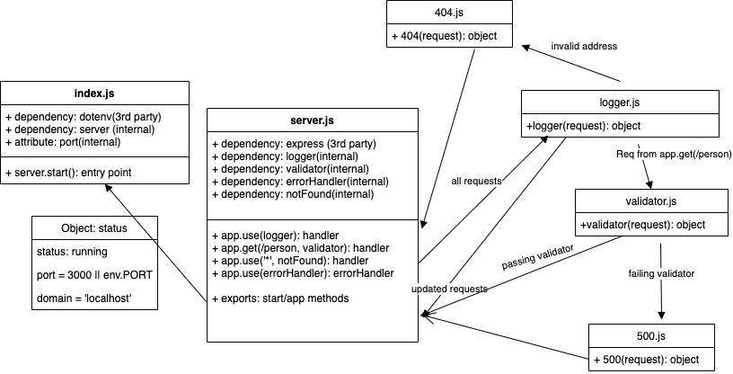

# basic-express-server

A simple and modular Express server

## Author: Anne Thorsteinson

**[Tests](https://github.com/AnneThor/basic-express-server/actions)**

**[Front End](https://express-basic-server.herokuapp.com/person?name=Anne)**

## Setup

```.env``` requirements:

- ```PORT``` - port number

## Running the App

- ```npm start```
- Endpoint ```/person?name=username```
  - Will return a json object:
  - ```{ name: username }```
  - failing to enter the optional name key/value will result in a 500 error

## Tests

- Unit Tests: ```npm run test```
- Lint Tests: ```npm run lint```


## UML Diagram 


